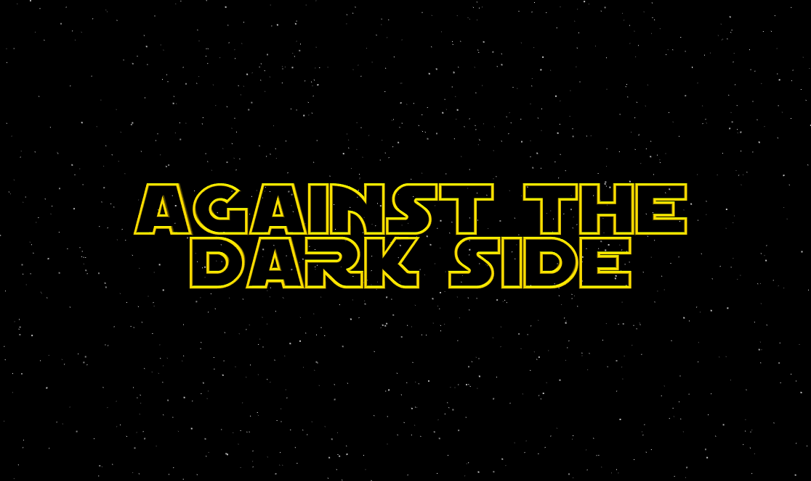

# Against the Dark Side
Against the Dark Side is a Star Wars-Tatooine Planet themed **browser game**. In this game, the player tries to reach the finish lines in consecutive levels to transmit the secret plans to the hidden base.  
**Blender** is used for rigging and modelling Stormtroopers.  
**Animations** are taken from [Mixamo](https://www.mixamo.com).  
**Heightmap** is generated for sand terrain from [Heightmap Generator](https://thealpacajumps.neocities.org/heightmap/).  
[A head-related transfer function (HRTF)](https://en.wikipedia.org/wiki/Head-related_transfer_function) is used for **positional sound effects**.

## Developed by
- [Fidan Samet](https://github.com/fidansamet)
- [Oğuz Bakır](https://github.com/oguzbakir)

## Developed with
- WebGL2
- [Three.js](https://github.com/mrdoob/three.js/)
- [Tween.js](https://github.com/tweenjs/tween.js/)

## Model References
- [Stormtrooper](https://clara.io/view/482639ab-1b62-4704-80dc-f7f019d857cb#)
- [BB8](https://sketchfab.com/3d-models/the-force-awakens-lowpoly-be3cf507c06943809ad779a1a72a044d)
- [Landspeeder](https://sketchfab.com/3d-models/star-wars-x-34-landspeeder-free-3adfdc41c67f4731910800404ba97b4e)
- [R2-D2](https://clara.io/view/1571df52-a48a-45a9-aeb3-9b2197a90fd6)
- [Blaster](https://sketchfab.com/3d-models/han-solos-dl-44-blaster-b7a11720c2254c92ac97874a40c0e815)
- [Bottle](https://clara.io/view/1feba15b-4af5-4b51-8854-6dfb8d59694f)
- [Stormtrooper Weapon](https://clara.io/view/21c110f9-e28e-4eae-af01-f9572e8f121e)
- [TIE Fighter](https://clara.io/view/4a8bf2a3-f47a-44f2-b117-f443dc076400)

Watch trailer: <https://www.youtube.com/watch?v=Y1EbZUzT21w>  
Play it: <https://fidansamet.github.io/Against-the-Dark-Side>

